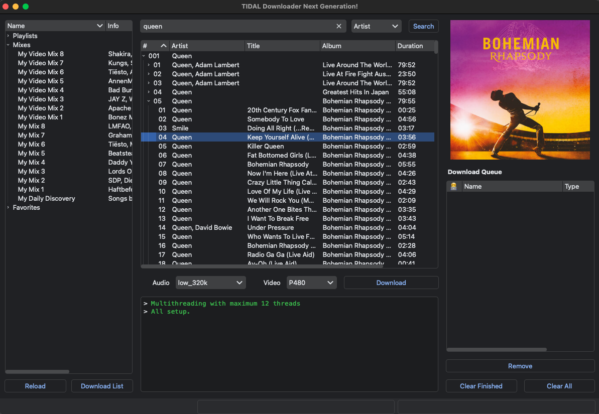

#  Tidal DL Pro

[](https://github.com/rgnet1/tidal-dl-ng/releases)
[](https://github.com/rgnet1/tidal-dl-ng/graphs/commit-activity)
[](https://github.com/rgnet1/tidal-dl-ng/blob/master/LICENSE)

**Tidal DL Pro** is a TIDAL downloader with a **browser web UI** (Docker) and the original **CLI / GUI** from [tidal-dl-ng](https://github.com/exislow/tidal-dl-ng). Multithreaded and multi-chunked downloads are supported.

## Docker (web UI)

The web UI is a **FastAPI** backend with an **Alpine.js + Tailwind** single-page frontend, packaged for Docker. From any browser on your LAN you get:

- **Search** tracks, albums, artists, playlists, and videos (or paste a TIDAL URL directly)
- **Your TIDAL library** — playlists, mixes, and favorites in the sidebar
- **Download queue** with real-time progress over WebSocket
- **Settings** for engine, audio/video quality, lyrics, and FLAC extraction
- **Dark / light mode** with system-preference detection

### Run a published release

The release image is published to GitHub Container Registry and Docker Hub. By default, the release compose file tracks `latest` from GHCR:

```bash
mkdir -p config downloads
docker compose -f docker-compose.release.yml up -d
```

Pin a specific version when you want reproducible deploys:

```bash
APP_IMAGE=ghcr.io/rgnet1/tidal-dl-pro:1.0.0 docker compose -f docker-compose.release.yml up -d
APP_IMAGE=<dockerhub-user>/tidal-dl-pro:1.0.0 docker compose -f docker-compose.release.yml up -d
```

The release workflow publishes `latest`, `1.0.0`, `1.0`, and `1` tags. Configure repository secrets `DOCKER_USERNAME` and `DOCKER_PASSWORD`, then run the **Release containers** workflow with version `1.0.0` or push tag `v1.0.0`.

### Build locally

From the repository root (see `docker-compose.yml`):

```bash
mkdir -p config downloads
docker compose up -d --build
```

Then open **http://localhost:8000** in a browser, sign in to TIDAL, and search or use your library.

- **Logs:** `docker compose logs -f tidal-dl-pro-web`
- **Stop:** `docker compose down`
- **Data:** `./config` holds auth and settings; `./downloads` is the default download folder (both are bind mounts in compose).

Equivalent **`docker run`** after building the image locally (`docker build -t tidal-dl-pro .`):

```bash
mkdir -p config downloads
docker run -d \
  --name tidal-dl-pro-web \
  -p 8000:8000 \
  -e PUID=1000 \
  -e PGID=1000 \
  -v "$(pwd)/config:/config" \
  -v "$(pwd)/downloads:/downloads" \
  --restart unless-stopped \
  tidal-dl-pro
```

### Environment variables

Override these in `docker-compose.yml`, an `.env` file, or via `docker run -e`:

| Variable | Default | Purpose |
| --- | --- | --- |
| `PUID` | `1000` | UID the container runs as; match your host user for bind-mount ownership |
| `PGID` | `1000` | GID to run as |
| `XDG_CONFIG_HOME` | `/config` | Where `settings.json` / `token.json` are read and written |
| `DOWNLOAD_PATH` | `/downloads` | Default `download_base_path` when settings are first created |
| `TIDDL_PATH` | `/config/tiddl` | tiddl engine stores its mirrored `config.toml` + `auth.json` here |
| `ACTIVE_ENGINE` | _(unset)_ | Boot default engine: `tidal-dl-ng` or `tiddl`; overrides the saved choice until you change it in Settings |

### Data & persistence

Two bind mounts keep state on the host so **nothing is lost on image rebuild**:

| Host path | Container path | Contents |
| --- | --- | --- |
| `./config` | `/config` | Unified `unified/settings.json` + `unified/auth.json`, plus per-engine mirrors under `tidal_dl_ng/` and `tiddl/` |
| `./downloads` | `/downloads` | Downloaded media |

On first boot the entrypoint remaps the container `app` user to `PUID:PGID` and chowns `/config`. Your TIDAL OAuth token survives `docker compose down` because it lives in `./config/tidal_dl_ng/token.json` on the host.

### Web UI settings

Open the gear icon (top-right):

- **Download engine** — `tidal-dl-ng` (default; full library + mixes) or `tiddl` (experimental; favorites-based playlists, no user mixes list). Tokens are mirrored so you can switch without logging in again.
- **Audio quality** — Low up to Hi-Res Lossless (24-bit / 192 kHz; requires TIDAL HiFi Plus)
- **Video quality** — 360p–1080p
- **Skip existing**, **download delay**, and concurrency options
- **Metadata** — embed lyrics, save separate `.lrc`, and FLAC extraction (FFmpeg is bundled in the image)

### Web API

Interactive docs are served at **http://localhost:8000/docs**. Key endpoints: `GET /api/status`, `POST /api/auth/login`, `POST /api/search`, `GET /api/library/lists`, `POST /api/download/add`, `POST /api/download/start`, `GET`/`PUT /api/settings`, and `WebSocket /ws` for live updates.

### Web troubleshooting

- **`/ws` returns 404 / "No supported WebSocket library"** — rebuild with `docker compose build --no-cache`; the image pins `uvicorn[standard]`.
- **Wrong file ownership on `./config` or `./downloads`** — set `PUID`/`PGID` to your host user (`id -u` / `id -g`) and restart; the entrypoint re-chowns on the next start.
- **Container won't start** — inspect `docker compose logs tidal-dl-pro-web`, then `docker compose build --no-cache`.
- **FLAC extraction failed** — FFmpeg ships in the image; for non-Docker use, install FFmpeg and set `path_binary_ffmpeg` correctly.

**Renaming the GitHub repository** to `tidal-dl-pro` (to match the product name): run `gh repo rename tidal-dl-pro` from a clone with a token that has **admin** on the repo, then `git remote set-url origin git@github.com:rgnet1/tidal-dl-pro.git` and update badge URLs in this README to `rgnet1/tidal-dl-pro`.

⚠️ **Windows** Defender / **Anti Virus** software / web browser alerts, while you try to download the app binary: This is a **false positive**. Please read [this issue](https://github.com/exislow/tidal-dl-ng/issues/231), [PyInstaller (used by this project) statement](https://github.com/pyinstaller/pyinstaller/blob/develop/.github/ISSUE_TEMPLATE/antivirus.md) and [the alternative installation solution](https://github.com/exislow/tidal-dl-ng/?tab=readme-ov-file#-installation--upgrade).

**A paid TIDAL plan is required!** Audio quality varies up to HiRes Lossless / TIDAL MAX 24-bit, 192 kHz depending on the song available. Dolby Atmos is supported. You can use the command line or GUI version of this tool.



```bash
$ tidal-dl-ng --help

 Usage: tidal-dl-ng [OPTIONS] COMMAND [ARGS]...

╭─ Options ────────────────────────────────────────────────────────────────────╮
│ --version  -v                                                                │
│ --help     -h        Show this message and exit.                             │
╰──────────────────────────────────────────────────────────────────────────────╯
╭─ Commands ───────────────────────────────────────────────────────────────────╮
│ cfg    Print or set an option. If no arguments are given, all options will   │
│        be listed. If only one argument is given, the value will be printed   │
│        for this option. To set a value for an option simply pass the value   │
│        as the second argument                                                │
│ dl                                                                           │
│ dl_fav Download from a favorites collection.                                 │
│ gui                                                                          │
│ login                                                                        │
│ logout                                                                       │
╰──────────────────────────────────────────────────────────────────────────────╯
```

If you like this project and want to support it, feel free to buy me a coffee 🙃✌️

<a href="https://www.buymeacoffee.com/exislow" target="_blank"></a>
<a href="https://ko-fi.com/exislow" target="_blank" rel="noopener noreferrer"></a>

## 💻 Installation / Upgrade

**Requirements**: Python version 3.12 / 3.13 (other versions might work but are not tested!)

```bash
pip install --upgrade tidal-dl-ng
# If you like to have the GUI as well use this command instead
pip install --upgrade "tidal-dl-ng[gui]"
```

## ⌨️ Usage

You can use the command line (CLI) version to download media by URL:

```bash
tidal-dl-ng dl https://tidal.com/browse/track/46755209
# OR
tdn dl https://tidal.com/browse/track/46755209
```

Or by your favorites collections:

```bash
tidal-dl-ng dl_fav tracks
tidal-dl-ng dl_fav artists
tidal-dl-ng dl_fav albums
tidal-dl-ng dl_fav videos
```

You can also use the GUI:

```bash
tidal-dl-ng-gui
# OR
tdng
# OR
tidal-dl-ng gui
```

If you would like to use the GUI version as a binary, have a look at the
[release page](https://github.com/exislow/tidal-dl-ng/releases) and download the correct version for your OS.

## 🧁 Features

- Download tracks, videos, albums, playlists, your favorites etc.
- Multithreaded and multi-chunked downloads
- Metadata for songs
- Adjustable audio and video download quality.
- FLAC extraction from MP4 containers
- Lyrics and album art / cover download
- Creates playlist files
- Can symlink tracks instead of having several copies, if added to different playlists

## ▶️ Getting started with development

### 🚰 Install dependencies

Clone this repository and install the dependencies:

```bash
# First, install Poetry. On some operating systems you need to use `pip` instead of `pipx`
pipx install --upgrade poetry
poetry install --all-extras --with dev,docs
```

The main entry points are:

```bash
tidal_ng_dl/cli.py
tidal_ng_dl/gui.py
```

### 📺 GUI Builder

The GUI is built with `PySide6` using the [Qt Designer](https://doc.qt.io/qt-6/qtdesigner-manual.html):

```bash
PYSIDE_DESIGNER_PLUGINS=tidal_dl_ng/ui pyside6-designer
```

After all changes are saved, you need to translate the Qt Designer `*.ui` file into Python code, for instance:

```
pyside6-uic tidal_dl_ng/ui/main.ui -o tidal_dl_ng/ui/main.py
```

This needs to be done for each created / modified `*.ui` file accordingly.

### 🏗 Build the project

To build the project use this command:

```bash
# Install virtual environment and dependencies if not already done
make install
# Build macOS GUI
make gui-macos-dmg
# OR Build Windows GUI
make gui-windows
# OR Build Linux GUI
make gui-linux
# Check build output
ls dist/
```

See the `Makefile` for all available build commands.

The CI/CD pipeline will be triggered when you open a pull request, merge to main, or when you create a new release.

To finalize the set-up for publishing to PyPi or Artifactory, see [here](https://fpgmaas.github.io/cookiecutter-poetry/features/publishing/#set-up-for-pypi).
For activating the automatic documentation with MkDocs, see [here](https://fpgmaas.github.io/cookiecutter-poetry/features/mkdocs/#enabling-the-documentation-on-github).
To enable the code coverage reports, see [here](https://fpgmaas.github.io/cookiecutter-poetry/features/codecov/).

## ❓ FAQ

### macOS Error Message: File/App is damaged and cannot be opened. You should move it to Trash

If you download an (unsigned) app from any source other than those that Apple deems trusted, the application gets an extended attribute "com.apple.Quarantine". This triggers the message: "<application> is damaged and can't be opened. You should move it to the Bin."

Remove the attribute and you can launch the application. [Source 1](https://discussions.apple.com/thread/253714860?sortBy=rank) [Source 2](https://www.reddit.com/r/macsysadmin/comments/13vu7f3/app_is_damaged_and_cant_be_opened_error_on_ventura/)

```
sudo xattr -dr com.apple.quarantine /Applications/TIDAL-Downloader-NG.app/
```

Why is this app unsigned? Only developers enrolled in the paid Apple Developer Program are allowed to sign (legal) apps. Without this subscription, app signing is not possible.

Does Gatekeeper really annoy you, and you'd like to disable it completely? Follow this [link](https://iboysoft.com/tips/how-to-disable-gatekeeper-macos-sequoia.html)

### My (Windows) antivirus app XYZ says the GUI version of this app is harmful

Short answer: It is a lie. Get rid of your antivirus app.

Long answer: See [here](https://github.com/exislow/tidal-dl-ng/issues/231)

### I get an error when `extract_flac` is enabled

Your `path_binary_ffmpeg` is probably wrong. Please read over and over again the help of this particular option until you get it right what path to put for `path_binary_ffmpeg`.

### My Linux (e.g. Ubuntu) complains that `libxcb-cursor0` is not installed

Simply install this dependency using your OS specific package manager.

Ubuntu / Debian

```bash
sudo apt install libxcb-cursor0
```

### A terminal is flashing when I run this app on Windows

Please see this issue [#103](https://github.com/exislow/tidal-dl-ng/issues/103).

This is due to the Python `ffmpeg` library which is used and only happens on windows if `extract_flac` is activated.

### How can I download Dolby Atmos files?

You need to activate `download_dolby_atmos` in the settings. Then, if an item is available in Dolby Atmos, it will be downloaded as a Dolby Atmos file instead of a stereo audio file. Dolby Atmos is only available as 320kbps at TIDAL (you cannot adjust the quality for Dolby Atmos downloads). If an item is available in Dolby Atmos, the "Quality" column in the GUI will indicate this with `Dolby Atmos`.

## ‼️ Disclaimer

- For educational purposes only. I am not liable and responsible for any damage that happens.
- You should not use this method to distribute or pirate music.
- It may be illegal to use this app in your country.

## 🫂 Contributors

Thanks to all, who have contributed to this project!

Special thanks goes out to [@orbittwz](https://github.com/orbittwz) for all his support in the issues section.

<a href="https://github.com/exislow/tidal-dl-ng/graphs/contributors"></a>

This project is based on:

- [cookiecutter-poetry](https://fpgmaas.github.io/cookiecutter-poetry/)
